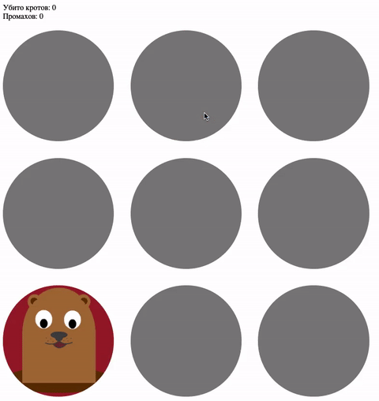

# Игра «Убей кротов»

Домашнее задание к занятию 1.1 «Возможности JavaScript в браузере».

## Описание 

Необходимо дописать игру, убивающую кротов при клике на них. 
В случайной лунке появляется крот. При нажатии на него, 
игроку засчитывается +1 за нажатие. 
Игрок побеждает, если своевременно убивает 10 кротов. 
При 5 поражениях игра заканчивается.

